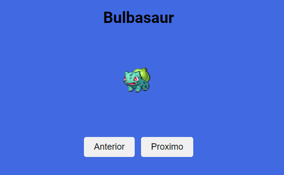
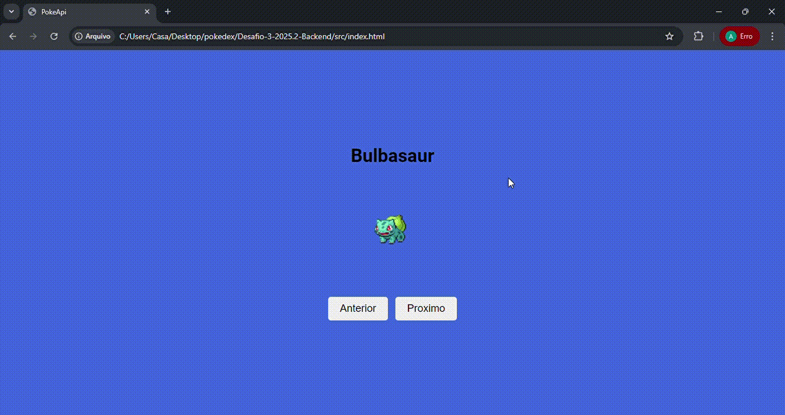

# 🦊 Documentação do Projeto

### O que compõe o desafio

O desafio consiste em implementar uma Pokédex funcional que consome dados da PokeAPI. A aplicação foi desenvolvida com:

- **HTML**: Estrutura com botões e elementos para exibição
- **CSS**: Estilização responsiva
- **JavaScript**: Lógica para consumir API, gerenciar e navegar entre pokémons

### Exemplos de telas

#### Tela inicial



### Demonstração

Veja o funcionamento completo da aplicação em ação:



#### Arquivos principais:

```
assets: imagens e documentos
src:
- index.html    (Estrutura da página)
- script.js     (Lógica da aplicação com fetch e async/await)
- style.css     (Estilização da interface)
```

### Como usar o projeto

#### 1. Clone o repositório

```bash
git clone https://github.com/oalbertocavalcante/Desafio-3-2025.2-Backend.git
```

#### 2. Acesse a pasta do projeto

```bash
cd Desafio-3-2025.2-Backend
```

#### 3. Abra o arquivo HTML

- Abra o arquivo `src/index.html` em seu navegador
- Ou use a extensão **Live Server** no VS Code para atualização automática

#### 4. Navegue entre os pokémons

- Clique em **"Anterior"** para ver o pokémon anterior
- Clique em **"Próximo"** para ver o próximo pokémon
- Ao chegar no primeiro, clique em "Anterior" para ir para o último
- Ao chegar no último, clique em "Próximo" para voltar ao primeiro

### Funcionalidades implementadas

- Carregamento de 1292 pokémons da PokeAPI  
- Exibição do nome e imagem do pokémon atual  
- Navegação entre pokémons com botões Anterior/Próximo  
- Loop de navegação (primeiro → último e vice-versa)  
- Interface responsiva e moderna  
- Consumo de API com fetch e async/await  
